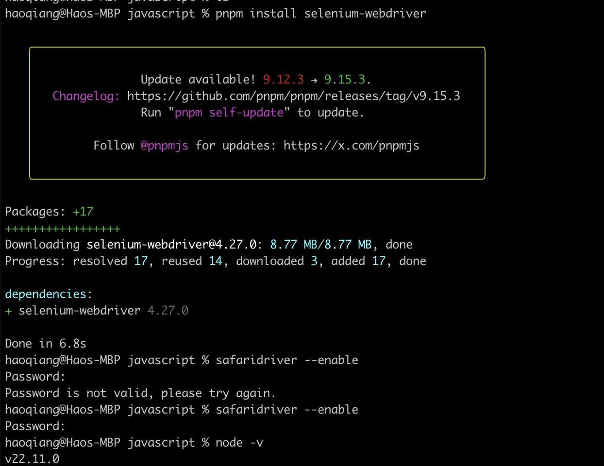
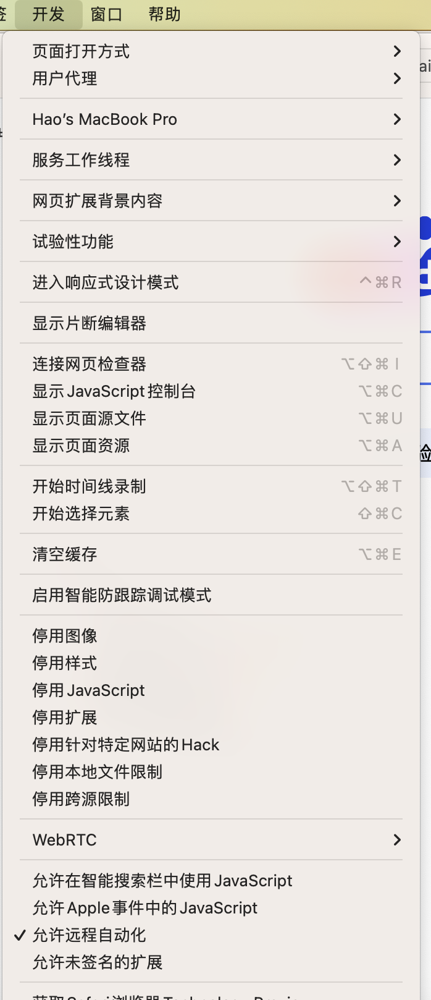

# Selenium webdriver Javascript 版
这里的Selenium不是化学元素硒，它是是一个浏览器自动化库。Selenium最常用于测试web应用程序，也可用于任何需要与浏览器自动交互的任务。
所以，‌Selenium除了自动化测试，还可以用于数据采集、表单提交、动态网页数据获取和模拟用户操作‌。
## 安装 Selenium webdriver Javascript client
```javascript
pnpm install selenium-webdriver
```
Selenium支持主流的浏览器，但需要你下载额外的组件才能与每个主流浏览器一起工作。
Chrome、Firefox以及微软的IE和Edge网络浏览器的驱动程序都是独立的可执行文件，应该放在您的系统PATH上。
苹果的safardriver （v10及以上）可以在以下路径中找到- /usr/bin/safardriver。
要在safari上启用自动化，需要运行safardriver——enable命令

执行完以上命令后可以打开Safari浏览器，在“开发”菜单里“允许远程自动化”选项被打开。


| 浏览器 | 组件 | 
| --- | --- | 
| Chrome | [chromedriver](https://googlechromelabs.github.io/chrome-for-testing/#stable) |
| Internet Explorer | [IEDriverServer.exe](https://www.selenium.dev/downloads/) | 
| Edge | [MicrosoftWebDriver.msi](http://go.microsoft.com/fwlink/?LinkId=619687)| 
| Firefox | [geckodriver](https://github.com/mozilla/geckodriver/releases/) | 
| Opera | [operadrive](https://github.com/operasoftware/operachromiumdriver/releases)| 
| Safari | [safaridriver](https://developer.apple.com/library/prerelease/content/releasenotes/General/WhatsNewInSafari/Articles/Safari_10_0.html#//apple_ref/doc/uid/TP40014305-CH11-DontLinkElementID_28) |
